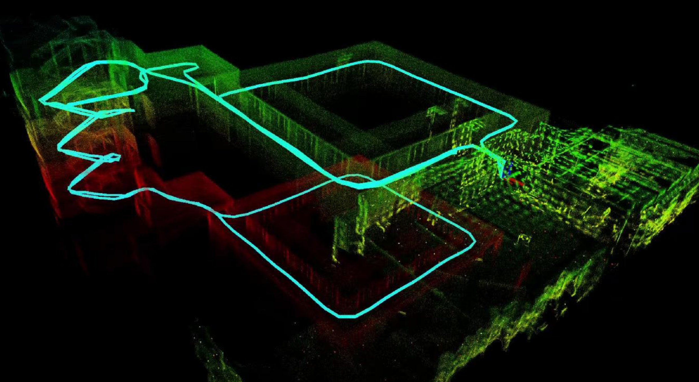

# Fast-LIO2 + Ego-Planner




## 实验配置
- 激光雷达：Mid360
- IMU：Mid360自带的IMU
- 驱动包：Livox SDK2

## 环境配置
```bash
# Ceres 2.1.0
sudo apt-get -y install liblapack-dev libsuitesparse-dev libcxsparse3 libgflags-dev libgoogle-glog-dev libgtest-dev
wget -O ceres-solver.zip https://github.com/ceres-solver/ceres-solver/archive/refs/tags/2.1.0.zip
unzip -q ceres-solver.zip -d "${TRDPARTY_DIR}"
pushd "${TRDPARTY_DIR}/ceres-solver-2.1.0"
mkdir build
cd build
cmake -DBUILD_SHARED_LIBS=TRUE ..
make -j8
sudo make install

# Eigen 3.3.7
wget -O eigen3.zip <https://gitlab.com/libeigen/eigen/-/archive/3.3.7/eigen-3.3.7.zip>
unzip -q eigen3.zip -d "${TRDPARTY_DIR}"
pushd "${TRDPARTY_DIR}/eigen-3.3.7"
mkdir build
cd build
cmake -DBUILD_SHARED_LIBS=TRUE ..
sudo make install
sudo ln -s /usr/include/eigen3/Eigen /usr/include/Eigen

# GTSAM
cd ~
git clone https://github.com/borglab/gtsam.git
mkdir build && cd build
cmake -D GTSAM_USE_SYSTEM_EIGEN=ON ..
make
sudo make install

# Livox SDK2
git clone https://github.com/Livox-SDK/Livox-SDK2.git
cd Livox-SDK2
cd build && cmake ..
make
sudo make install

# 下载 & 编译项目
git clone https://github.com/emNavi/Fast-LIO2.git
cd src/livox_ros_driver2
# (这一步可能有报错但是不用管)
./build.sh ROS1

# 然后回退到项目根目录
catkin_make -j1
# 编译的时候有一些问题，可能是因为自定义消息没有被先编译所以被错误的引用，导致编译失败，可以试试 -j1 或者不加，一直增量的编肯定能过

```

## 使用
Mid360激光雷达上电，插入Mid360激光雷达网口至电脑，[配置好 livox_ros_driver2 驱动包中的 IP 地址](https://github.com/Livox-SDK/livox_ros_driver2?tab=readme-ov-file#4-lidar-config)，确保雷达可使用
```bash 
# 开启 Fast_LIO 算法
bash ./run_fast_lio.sh 

# 开启 Ego-Planner 算法（需要去预设规划航点）
bash ./run_ego_planner.sh
```

注：[预设规划航点可修改该文件](https://github.com/emNavi/Fast-LIO2/blob/main/src/ego-planner-swarm-v1/src/planner/plan_manage/launch/param.xml)